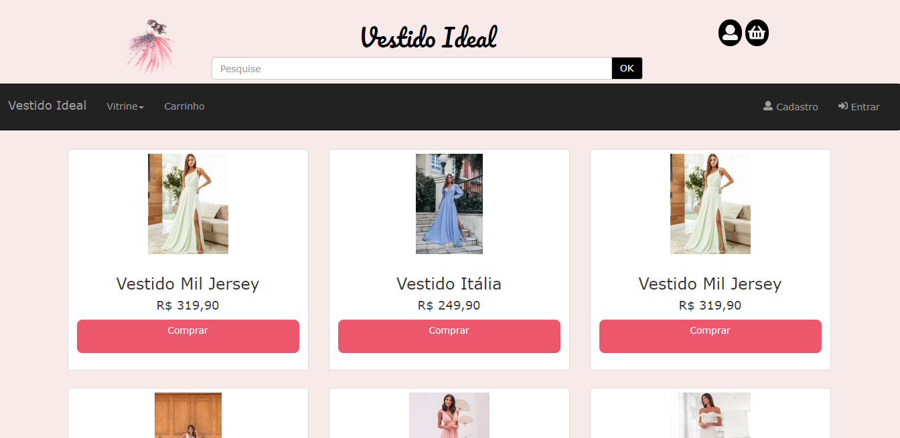
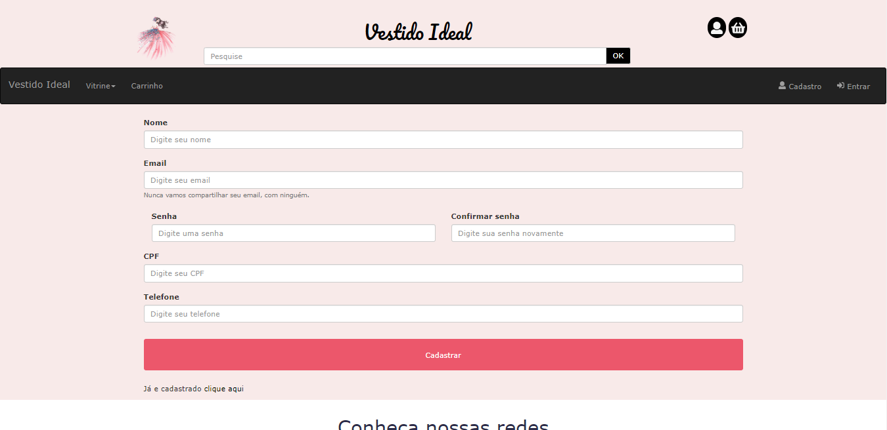
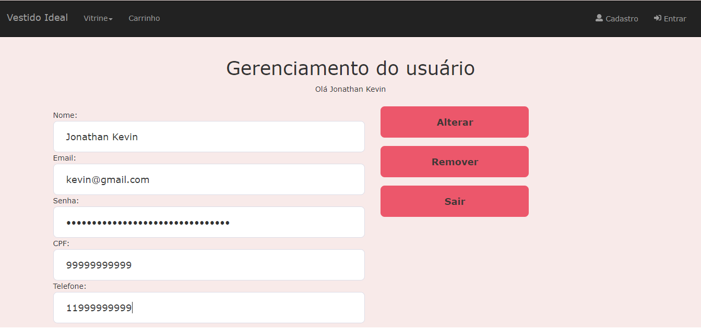
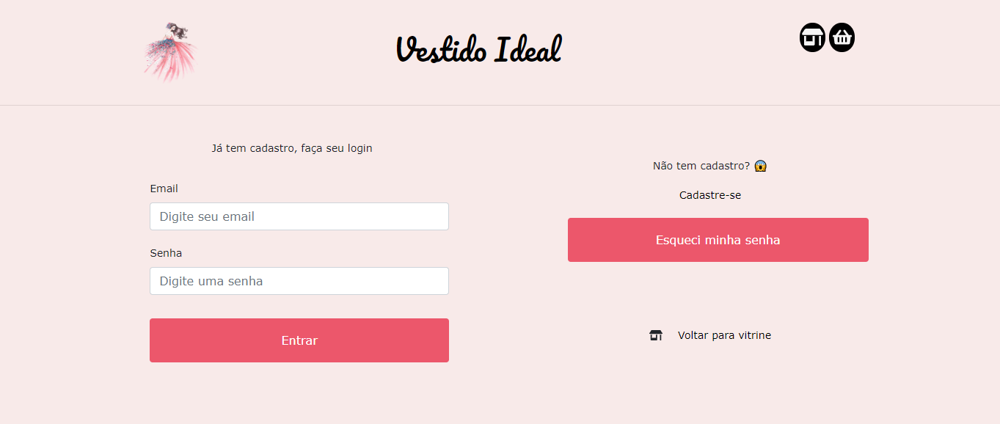

<h1 align=center> Vestido Ideal </h1>

  

O vestido Ideal é um site de vendas de roupas para festa, ele foi desenvolvido durante um semestre na faculdade na matéria de programação web. 

  
## ℹ️ Funções
* **Vitrine:** Apresenta todas as roupas do banco dados.
* **Cadstro:** Através do cadastro é adicionado ao banco de dados um novo ciente, pesquisando se aquele email ou cpf já está cadastrado, estando cadastrado ele não aceita utilizar esses dados.
* **Login:** Busca no banco o email e senha, a validando se aquele cliente existe.
* **Pesquisar:** Colocando alguma característica na barra de busca e dar "ok", faz uma busca no banco e trás todos os produtos com a característica que foi buscada.
* **Alterar dados:** Busca os dados do cliente logado e exibe, é possivel alterar ou apagar o usuario nessa pagina. 

## 🚀 Tecnologias
* **HTML**.
* **CSS**.
* [**Bootstrap**](https://getbootstrap.com/).
* [**JavaScript**](https://www.javascript.com).
* [**Jquery**](https://jquery.com/).
* [**PHP**](https://www.php.net/manual/pt_BR/intro-whatis.php).
* [**Mysql**](https://www.mysql.com/).

## 🖼 Prints do sistema

  
<b>Vitrine</b>

  
  
<b>Carrinho</b>

  
  
<b>Cadastro</b>

  
  
<b>Conta</b>

  
  
<b>Login</b>

  

## ✍ Colaboradores
👤 **Jonathan Kevin**
  * Github: [@JonathanKBP](https://github.com/JonathanKBP/)
  
👤 **Aline Soares**
  * Github: [@Aline595](https://github.com/Aline595)
  
👤 **Celso Henrique**

👤 **Alice Toledo**
